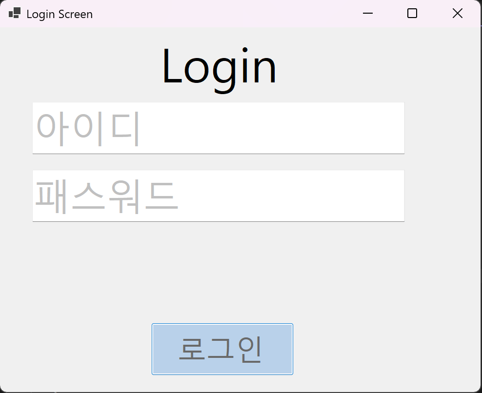
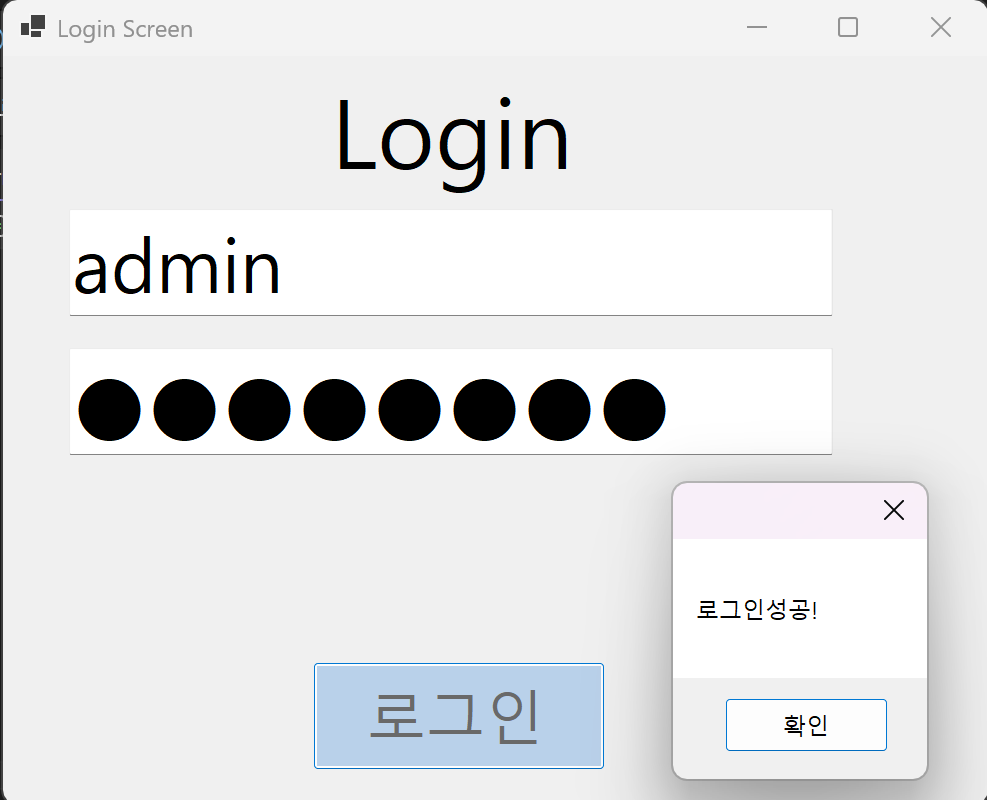
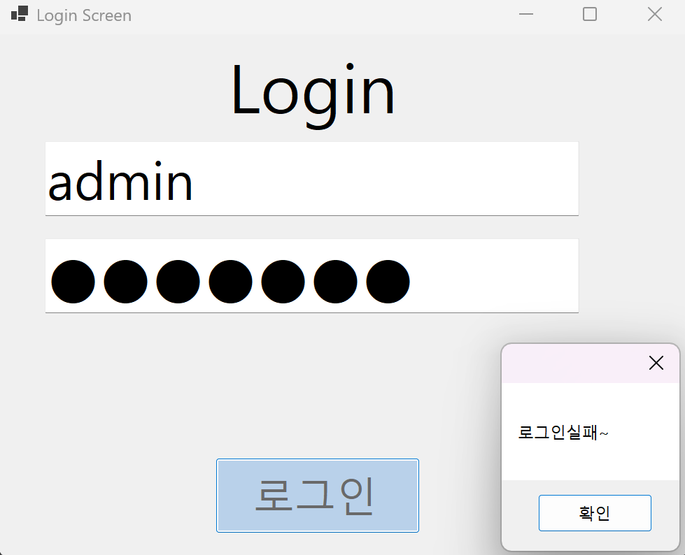
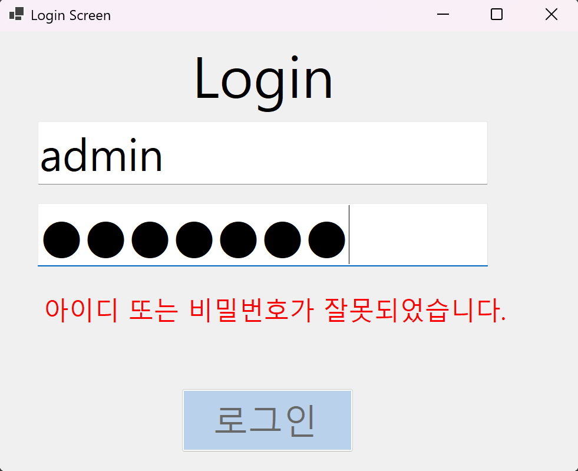

(C# 코딩)로그인 화면 (Login Screen)

## 개요
- C# 프로그래밍 학습
- 1줄 소개: 사용자로부터 아이디와 비밀번호를 입력받아 로그인 성공 여부를 판단하는 Windows Forms 기반 로그인 프로그램
- 사용한 플랫폼:
	- C#, .NET Windows Forms, Visual Studio, GitHub
- 사용한 컨트롤:
	- Label → 로그인 화면 제목 표시
	- TextBox → 아이디 및 비밀번호 입력 (txtID, txtPw)
	- Button → 로그인 실행 (btnLogin)

- 사용한 기술과 구현한 기능
	- Visual Studio를 이용하여 로그인 UI를 구성함
	- TextBox의 Text 속성을 활용하여 사용자 입력값 처리
	- ForeColor를 이용하여 Placeholder(아이디, 비밀번호 안내 문구) 구현
	- PasswordChar 속성을 사용하여 비밀번호 입력 시 ● 표시 처리
	- 조건문(if문)과 논리연산자(&&)를 사용하여 아이디와 비밀번호 일치 여부 확인
	- MessageBox를 사용하여 로그인 성공 및 실패 메시지 출력

- 수업 중에 배우고 사용했던 클래스들 관련된 설명

- 실습 중에 구현한 기능들 설명

## 실행 화면 (과제1)

	- 로그인 화면 제목과 아이디, 비밀번호 입력창이 Placeholder(아이디, 비밀번호 안내 문구)로 표시되어 있음

	- 로그인 성공화면과 실패화면

- 과제 내용
	- 아이디와 비밀번호를 입력받아 로그인 성공 여부를 판단하는 프로그램 구현
	- Label(표시), TextBox(입력), Button(전송) 컨트롤을 활용하여 로그인 UI 구성
	- 아이디와 패스워드 입력창에 Placeholder(아이디, 비밀번호 안내 문구) 구현
	- 아이디와 패스워드 일치 여부를 판단하여 로그인 성공 또는 실패 메시지 출력

- 구현 내용과 기능 설명
	- 처음 실행시 입력 포커스가 버튼으로 가도록 조정
	- 아이디와 패스워드 입력창에 Placeholder(아이디, 비밀번호 안내 문구) 표시되도록 구현
	- 아이디와 패스워드 입력창에 포커스가 가면 Placeholder 사라지고, 포커스가 벗어나면 Placeholder 다시 표시되도록 구현
	- 아이디 및 패스워드 일치 여부를 판단하여 로그인 성공 또는 실패 메시지 출력

## 실행 화면 (과제2)

	- 로그인 실패시 메시지박스를 출력하는것이 아닌 로그인 실패 메시지를 Label로 표시하도록 변경		
	
- 과제 내용
	- 로그인 실패 메시지를 MessageBox로 출력하는 대신 Label로 표시하도록 변경
	- 기존 마우스로만 창 이동이 가능했던 것을 키보드(ENTER)로도 창 이동이 가능하도록 변경

- 구현 내용과 기능 설명
	- 아이디 입력하고 Enter 누르면 패스워드 입력창으로 이동
	- 패스워드 입력하고 Enter 누르면 “로그인” 버튼을 누른 것처럼 동작하도록 구현
	- 로그인 실패 메시지를 MessageBox로 출력하는 대신 Label로 표시하도록 구현